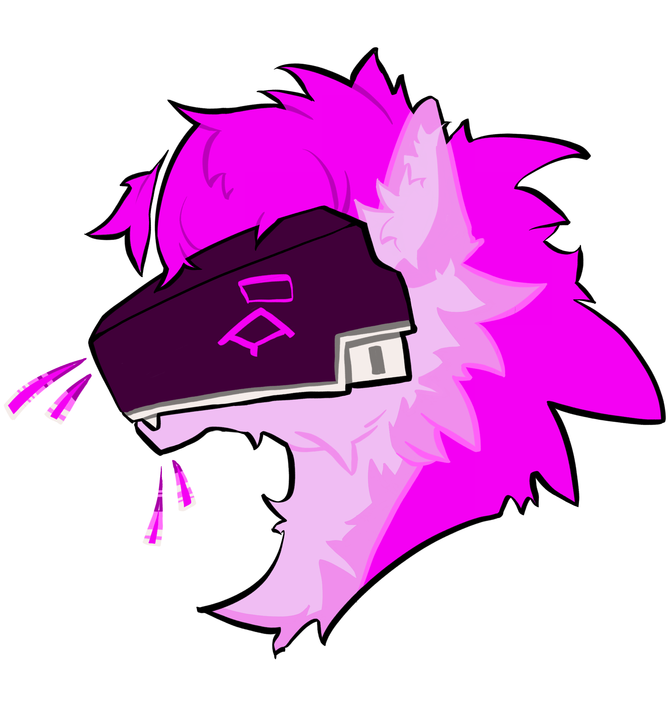

<h1 align="center">OpenProto</h1>
<h3 align="center"><i>The most beautiful way to control your Protogen</i></h3>
<h5 align="center">(Or any rgb panel project for that matter!) </h5>

## Features

- A mobile-first (fursuit friendly!) web interface for controlling/adding your expressions designed to be accessed
  through a phone hotspot
- A text animation framework for quickly creating new text-based animated expressions
- Customizable panel parameters to allow for a wide range of configurations
- Continuous, Mirrored, And Duplicated modes for chained panels
- Asynchronous loading of animations & smart swapping for a seamless experience

### Special thanks to Ray for all the awesome art!

## Installation & Running

1. Clone this repository on your raspberry pi and run `sudo sh first_run.sh` on your first installation.
2. Reboot your system if you were prompted to
3. (Optional) open a screen instance to allow you to run the program in the background
4. Run `sudo python3 main.py` to start the program
5. Connect to the web interface via your raspberry pi's IP address, adjust your settings, and go!

> [!WARNING]
> This server is NOT secure.
> The idea is you run this only on a local network, like a phone hotspot!
> In this case your weakest link is the security of the network this is connected to. Don't leave this passwordless
> Be careful who you give access!

#### Depends On:
- [rpi-rgb-led-matrix](https://github.com/hzeller/rpi-rgb-led-matrix)
- [gif.js](https://github.com/jnordberg/gif.js)
- [Konva](https://github.com/konvajs/konva)
- Flask

## Build Guide

These instructions will show you how to get basic LED panels connected to the software.

I won't be showing you how to build a fursuit (sorry)

#### Parts List:

- [Raspberry Pi LED Bonnet (Adafruit)](https://www.adafruit.com/product/3211)
- [Led Panels (Adafruit)](https://www.adafruit.com/product/420)
- [Power Supply](https://www.amazon.com/gp/product/B01D8FM71S/ref=ppx_yo_dt_b_asin_title_o03_s00?ie=UTF8&psc=1)
- [(Optional) Battery](https://www.amazon.com/gp/product/B0713XJBG2/ref=ppx_yo_dt_b_asin_title_o00_s00?ie=UTF8&th=1)
- A raspberry pi with wireless capabilities (I used a Zero 2 W)

### Build Steps

1. First, consult the parts list and acquire all you need. Of course, you may substitute any parts you cannot find or
   have found a better replacement for
2. Mount your Bonnet onto the GPIO pins with the board of the bonnet covering the raspberry pi. If you have a pi from
   the Zero lineup, the bonnet will cover the entire board
3. Wire up your displays. They should come with power cables as well as ribbon cables. Plug the connectors of the power
   cable into the back of the LED board, and wire the two exposed contact connectors into the terminal on the Bonnet
4. Connect the ribbon cable (provided) from your display to the board. It should denote on the back of the LED board
   which terminal to plug it into (mine say input).
   1. If you have multiple displays, pick the display you would like to be first in series and connect the ribbon cable
      from it's input side to the bonnet.
   2. When this is done, connect however many displays you have together through the first board's *output* terminal,
      wiring this to the next display's input terminal.

*psst. If you need more help wiring
check [this guide!](https://github.com/hzeller/rpi-rgb-led-matrix/blob/a3eea997a9254b83ab2de97ae80d83588f696387/wiring.md)*

5. Connect your raspberry pi to power through the barrel jack on the bonnet. You do not need to provide USB power to the
   raspberry pi, as it can fetch enough through the barrel jack.
6. Flash your raspberry pi with a LITE image.
7. Install & run this software as specified [here](#installation--running)
8. Enjoy! Your hardware mapping should be set to adafruit-hat, but if it is not change that in settings

## Legal Mumbo Jumbo

This project is licensed under The GNU General Public License (GPLv3.0) License.

You can:
- **Use** - You are allowed to use the software for any purpose, commercial or otherwise.
- **Modify** - You can modify the source code.
- **Distribute** - You can distribute the original or the modified software.

However, there are some conditions:

- **Disclose source** - Source code must be made available when the software is distributed.
- **Same License** - Modifications must be released under the same license.
- **State changes** - Changes made to the code must be documented.

Please read carefully the full [GPL-3.0 license](LICENSE) for more information.